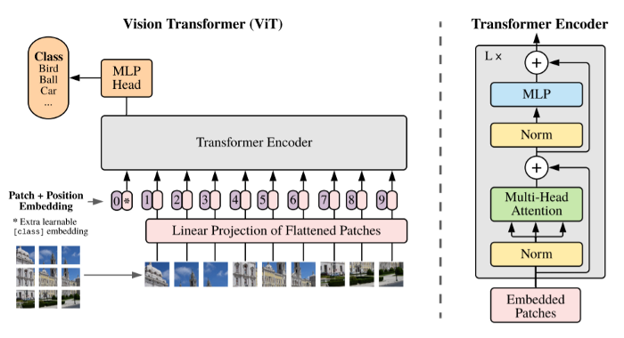

## 🧠 Vision Transformer (PyTorch)

A complete and easy-to-follow implementation of Google’s Vision Transformer proposed in  
**"An Image is Worth 16×16 Words"**.

This PyTorch implementation includes detailed comments for better understanding, making it especially useful for beginners exploring attention mechanisms and transformer-based models.

---

## 🖼️ Vision Transformer Architecture

<p align="center">
  
</p>

The above figure illustrates the full pipeline of the Vision Transformer, including patch embedding, positional encoding, and transformer encoder blocks.

---

## 📄 Reference Paper

**An Image is Worth 16×16 Words: Transformers for Image Recognition at Scale**  
👉 [Read the original paper]([https://arxiv.org/abs/2010.11929](https://arxiv.org/abs/2010.11929))

---

## ⚙️ Implementation Details

- Based on an existing implementation but follows the **original paper more closely**, especially:
  - Patch embedding strategy  
  - Initialization methods  

- Default dataset: **CIFAR-10**  
  - Can be easily modified to use **ImageNet** or other datasets  

- Uses `einops` for tensor manipulation  
  ```bash
  pip install einops
